# FYT UIS7862 — Mods, Root & Reskin Kit

Everything needed to take a **stock FYT (SYU) UIS7862 head unit** and turn it into a rooted,
de‑skeuomorphized, dark‑themed unit: root, custom boot splash, a 7870‑style SystemUI status bar,
a flat nav bar, a single‑page Lawnchair launcher, and modernized stock apps (EQ, FM radio, Bluetooth,
Settings) on a shared dark + slider‑blue (`#71B5FF`) design language.

> ⚠️ **This roots and modifies the system partition.** Done wrong it can soft‑brick the unit.
> The root method fails *safe* (a bad OTA is refused, nothing written), and there's a documented
> recovery, but read [docs/01-rooting.md](docs/01-rooting.md) fully before flashing.

## Background

This skin was made to **copy the look of a rare vertical Tesla‑style FYT UIS7870** head unit I bought — which
had too many bugs to keep. The **UIS7862** is still a great platform: tried‑and‑true and rock‑solid. So rather
than fight the 7870's bugs, I brought its cleaner look over to the 7862 and pushed it further — giving a
proven platform that same UI consistency and polish.

## The unit

| | |
|---|---|
| SoC | Unisoc **UIS7862** (board `ums512_1h10`) |
| Android | **10 / API 29** (build string is faked to "16"; SDK is the real ceiling) |
| Panel | **768×1024 portrait**, Tesla‑style, mounted 180° (`ro.sf.swrotation=180`) |
| Platform | FYT **6315** (`lsec6315` recovery), `ro.fyt.uiid=3`, manufacturer `135` |
| Launcher | `com.android.launcher6` (replaced with Lawnchair) |

## Gallery — how it looks now

**Before → after** — the stock home vs. the modded result:

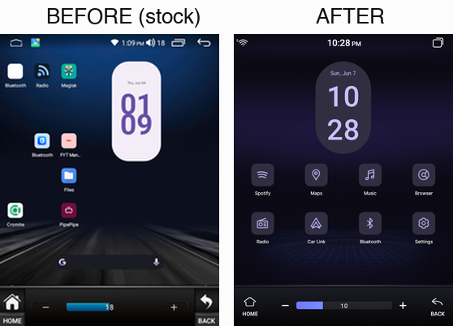

<table>
<tr>
<td align="center">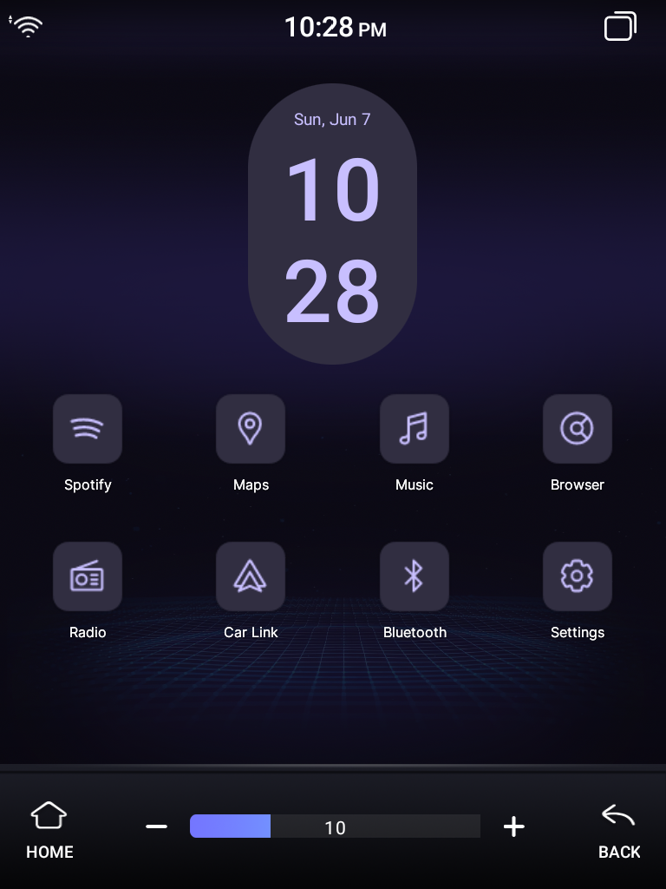 <b>Home</b> — Lawnchair + custom clock widget</td>
<td align="center">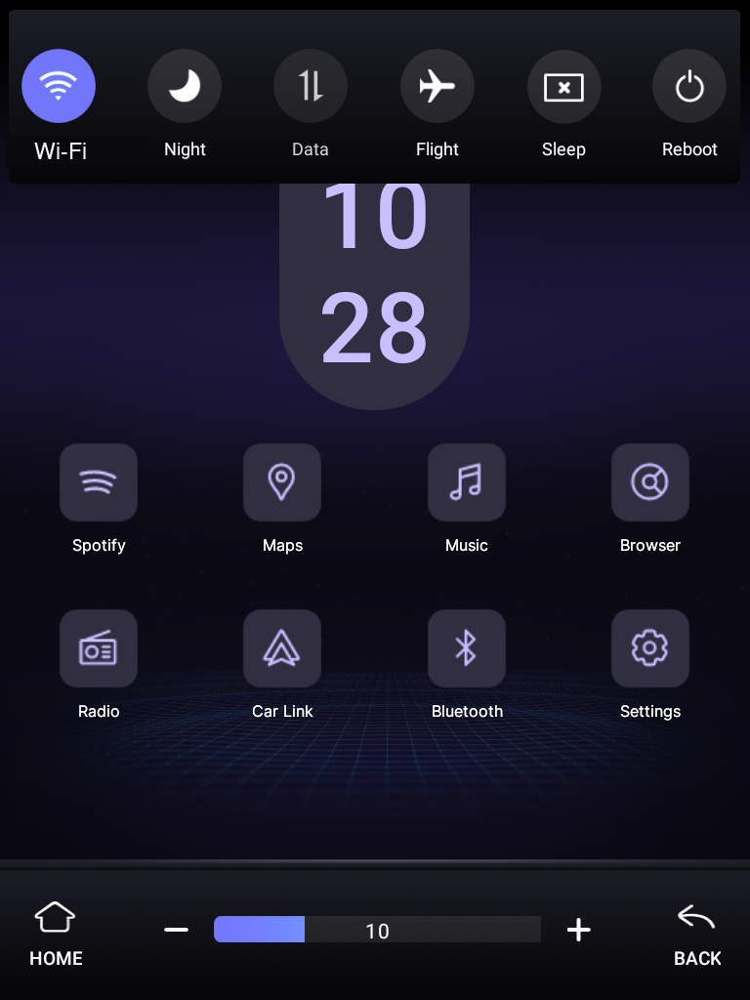 <b>Quick settings</b> — quick pull</td>
<td align="center">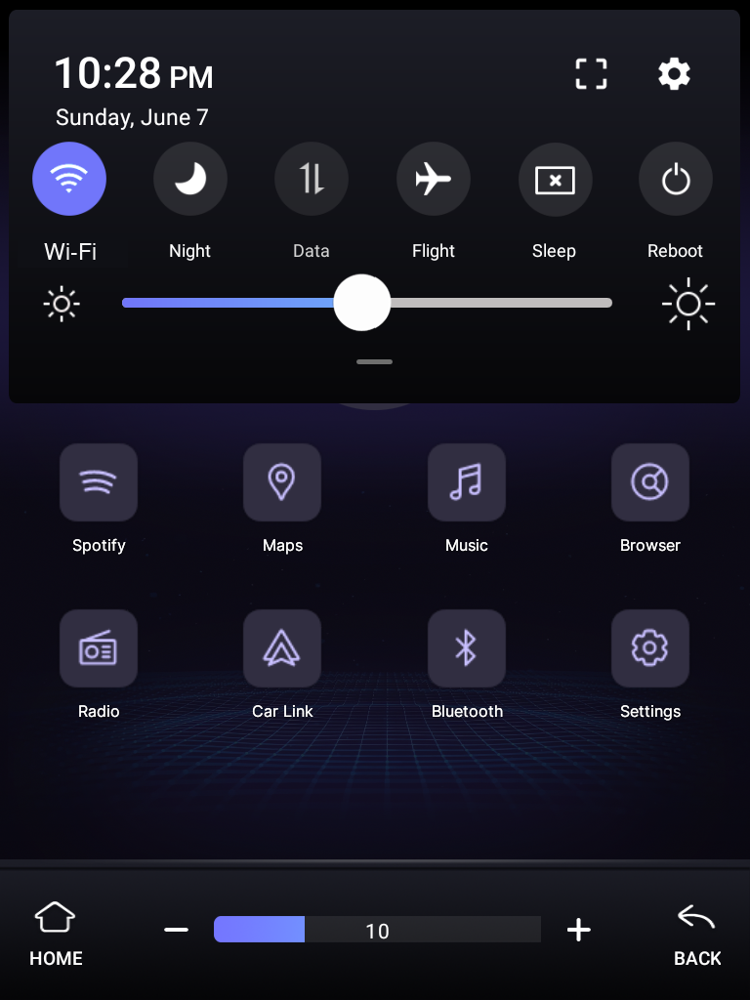 <b>Quick settings</b> — expanded</td>
<td align="center">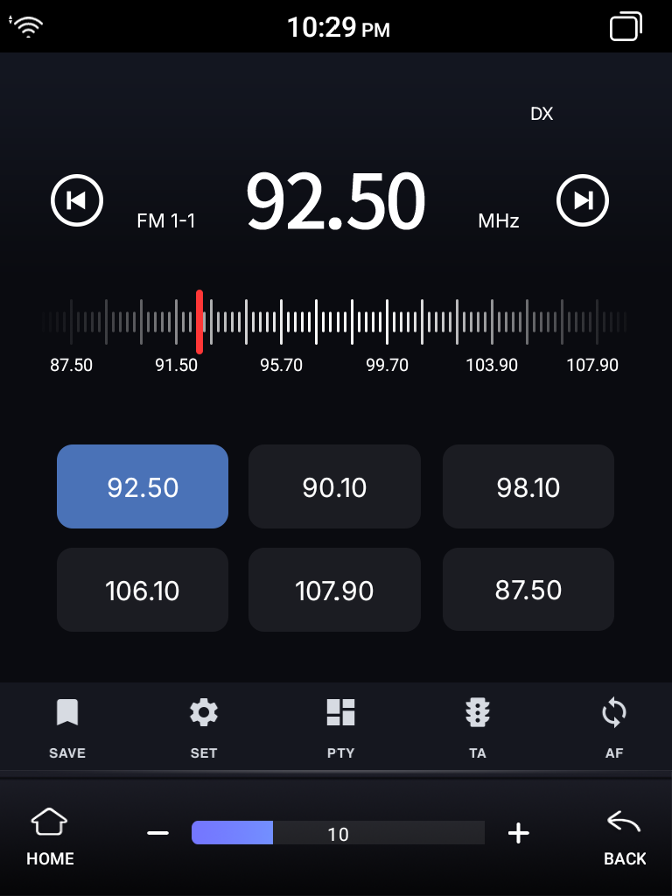 <b>FM radio</b></td>
</tr>
<tr>
<td align="center">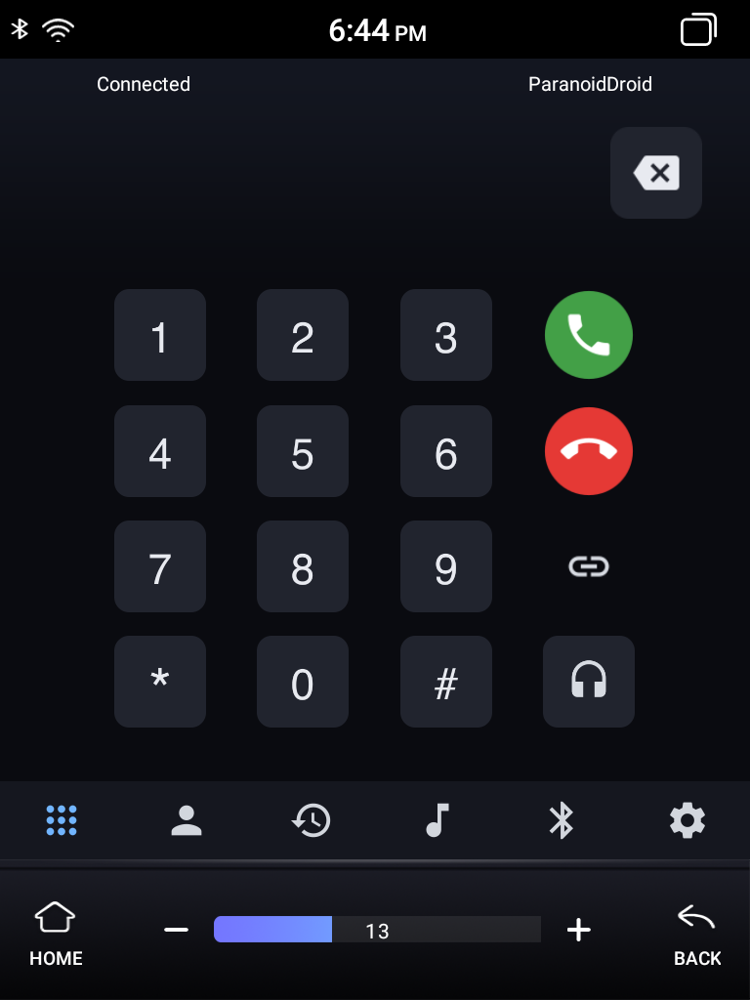 <b>Bluetooth</b> dialer</td>
<td align="center">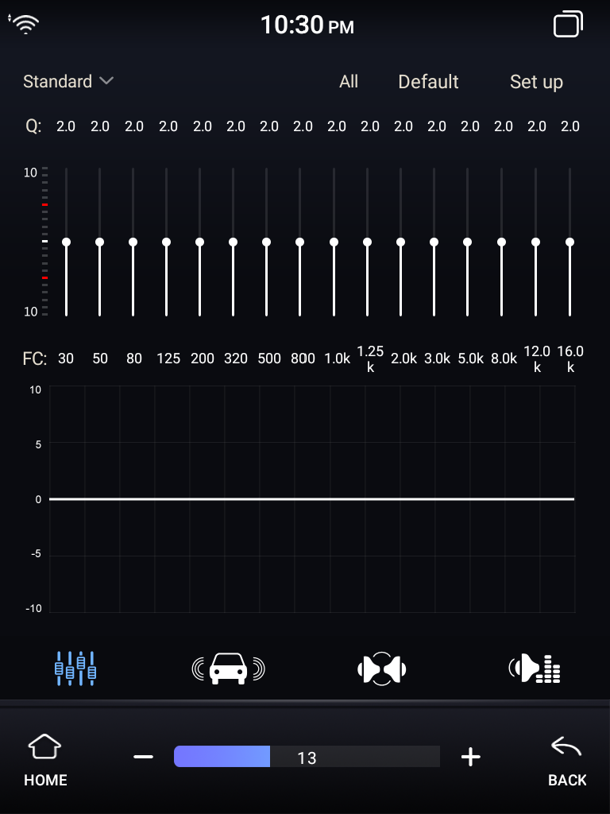 <b>Equalizer</b></td>
<td align="center">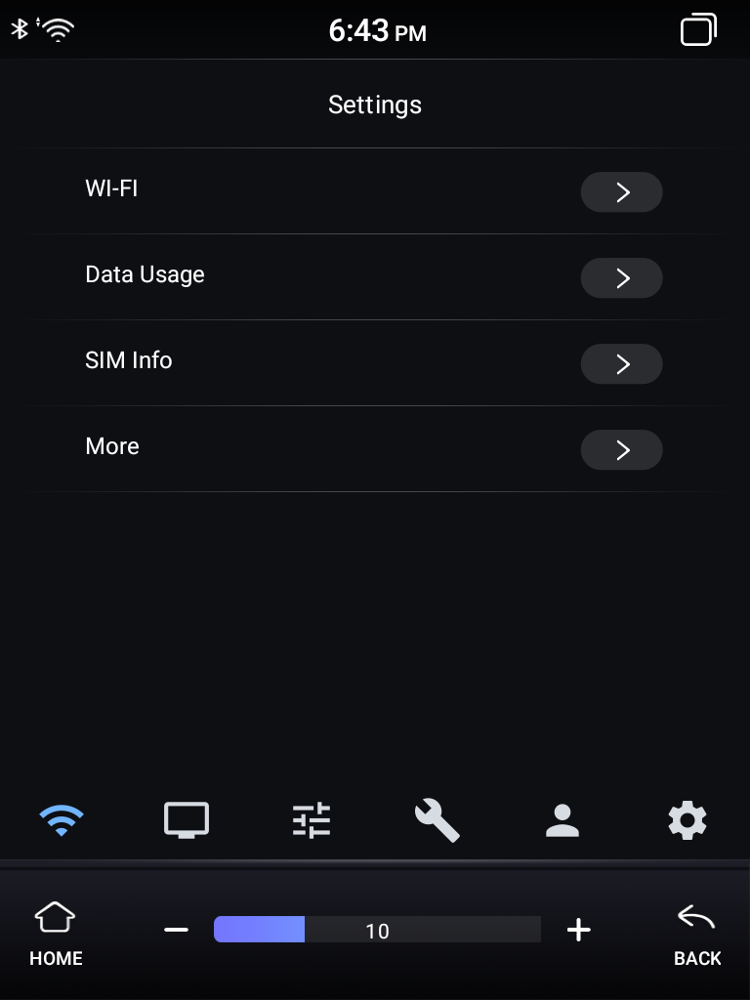 <b>Settings</b></td>
<td align="center">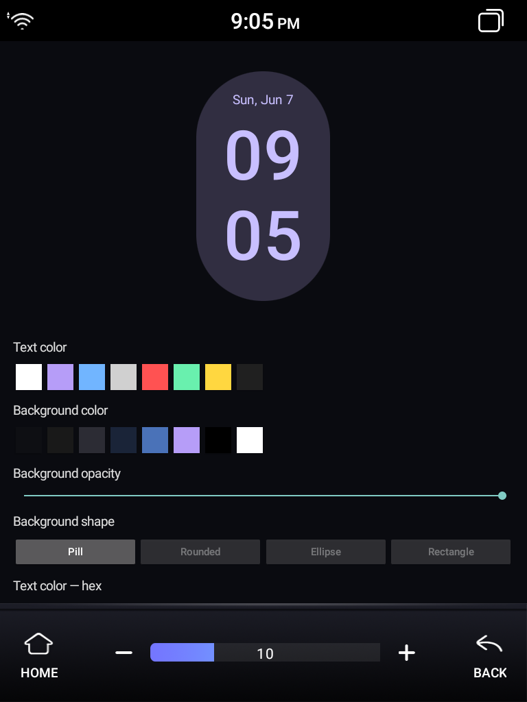 <b>Clock widget</b> config</td>
</tr>
</table>

Centered‑clock/left‑wifi status bar, flat nav bar with blue volume slider, and purple themed (Lawnicons) app
icons show across all shots. More in **[screenshots/](screenshots/)** — before/after and 7870 comparisons. (The
full raw build‑process archive is kept in a separate **private** research repo — it contains incidental on‑screen
PII, so only the curated shots are published here.)

## Status bar · nav bar · quick settings — before / after

Stock SYU UI vs. the modded result (owner‑recovered "before" shots):

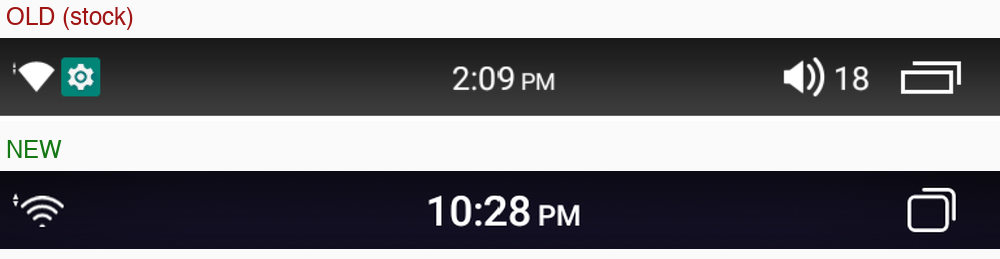 
Status bar — SYU gear + clutter gone, volume hidden, transparent, thicker wifi

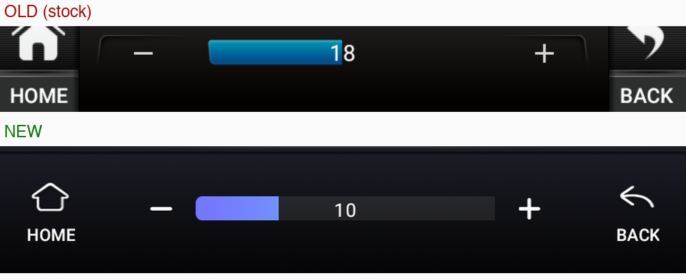 
Nav bar — flat, purple→blue volume slider

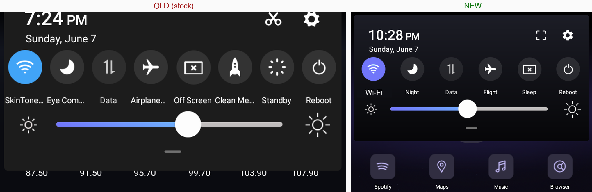 
Quick settings — 8→6 tiles, shorter labels, Material glyphs, purple accent

## What's in here

| Area | Doc | Result |
|---|---|---|
| Root (locked BL) | [01-rooting.md](docs/01-rooting.md) | Magisk via a boot‑only testkey‑signed OTA — no PC, fails safe |
| Boot splash | [02-boot-splash.md](docs/02-boot-splash.md) | Custom uboot logo + bootanimation |
| Status bar | [03-systemui.md](docs/03-systemui.md) | 7870 clone: centered clock, left wifi, thick wifi, hidden volume, transparent bar |
| Nav bar | [04-navbar.md](docs/04-navbar.md) | Flat `com.syu.air` bar, blue volume slider |
| Launcher | [05-launcher.md](docs/05-launcher.md) | Lawnchair, single full‑width home (two‑panel fix) |
| App reskins | [06-app-reskins.md](docs/06-app-reskins.md) | EQ, FM radio, Bluetooth, Settings → dark + slider‑blue |
| The skin system | [07-skin-system.md](docs/07-skin-system.md) | How SYU apps load skins + the no‑decrypt override trick |
| Applying changes | [08-applying.md](docs/08-applying.md) | The `/fem` in‑place install pipeline |
| Clock widget | [09-clock-widget.md](docs/09-clock-widget.md) | Custom clock: swatches, hex entry + visual color picker (no Gradle build) |
| Root vs not | [10-root-vs-not.md](docs/10-root-vs-not.md) | What needs root vs plain adb when applying to other FYTs |

`artifacts/` holds the built APKs, splash images, configs and the root package.
`scripts/` holds the reusable generators (gradients, icons, the install helper).
`screenshots/` holds before/after captures and 7870 comparisons — see [screenshots/](screenshots/).

## Quick start (high level)

1. **Connect ADB.** Rear 4‑pin USB‑A↔A + Dev‑options USB role = *Device* + reboot (see [docs](docs/00-overview.md)).
2. **Root** with the boot‑only OTA in `artifacts/root/` ([01-rooting.md](docs/01-rooting.md)).
3. **Set persistent wireless ADB**: `setprop persist.adb.tcp.port 5555`.
4. **Apply mods** by installing the APKs in `artifacts/` to `/oem` via the `/fem` alias ([08-applying.md](docs/08-applying.md)) and rebooting.

## Design language

Dark, near‑neutral surfaces; **one accent = the volume‑slider blue→cyan gradient** (`#7176FA → #6CDDFA`,
mid `#71B5FF`); no skeuomorphism (no bevels/gloss/reflections/iOS‑era icons). Functional colors kept
(red dial needle, green/red call buttons).

## Credits / lineage

Built on the FYT modding community (Mario Dantas MD‑EDITION kernels, surfer63 builds, XDA 4665690/4610985).
Root uses the public AOSP testkey the unit trusts. See per‑doc references.
