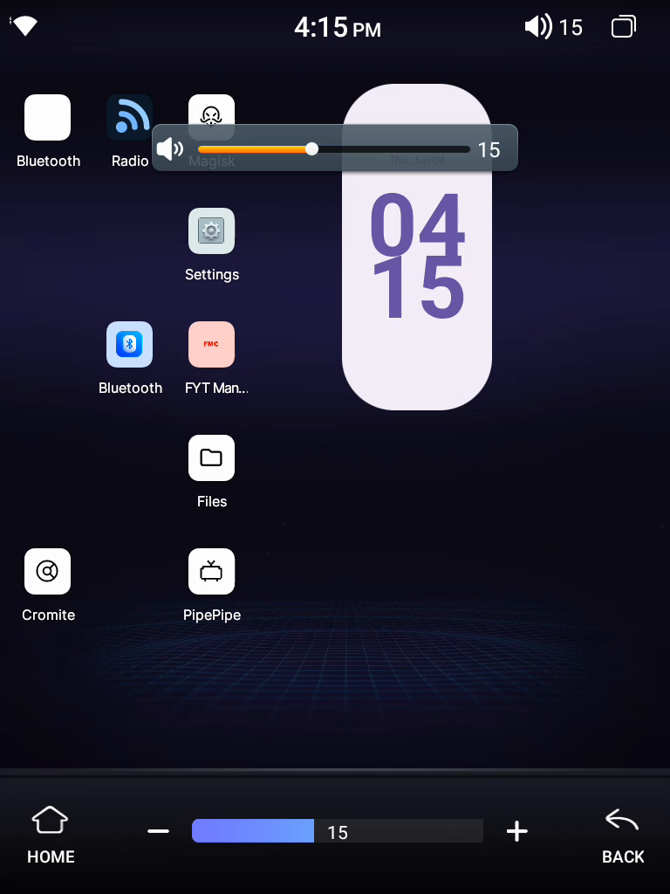

# 11 — Hiding the volume OSD (com.syu.ms)

The grey box with the **orange slider** that pops up on every volume change — from the steering‑wheel
buttons or the (now hidden) status‑bar volume button — is drawn by **`com.syu.ms`** (the MCU‑bridge
service; uid `system`, AOSP‑platform‑signed). It's pure clutter: the nav bar already shows the level live.

<p align="center"></p>

> The popup reads **15** — identical to the nav‑bar slider at the bottom of the *same* frame. The bar **is**
> the volume indicator, so the popup adds nothing. We disabled it rather than recoloring it.

The level readout you keep (`vol_text`) is a **separate** thing — drawn in `com.android.systemui` next to
`com.syu.air`'s NavigationBar (logcat tag `hzqvol`). Killing the popup doesn't touch it.

## Finding the draw path

`adb logcat` filtered to tag **`VOL`** shows the whole chain when you nudge the volume:

```
E VOL: =====>>> show() isEnableVolBar() = true   <- com.syu.ms  ui/b$a.show()
E VOL: ====>>> Control Bar show                  <- active variant  ui/a.e()
E VOL: ====>>> to show vol window                <- runnable  ui/a$a.run()
E VOL: ====>>> addRootView                        <- La/e;->b()  = WindowManager.addView
```

So: base `ui/b$a.show()` (logs `isEnableVolBar`) → variant `e()` → an inner **Runnable `ui/a$a.run()`**
that logs "to show vol window" and calls `La/e;->b(Object)` (the real `addRootView`, with a 100 ms
`postDelayed` retry until the root view attaches).

## The fix: no‑op the runnable

One smali edit — an early `return-void` at the top of `ui/a$a.run()`, so the popup is never built:

```smali
.method public run()V
    .locals 23

    return-void          # <-- added: popup is never drawn

    move-object/from16 v0, p0
    ...
```

Full decode → edit smali → `apktool b` → `zipalign -p 4` → sign with the **platform key**. `com.syu.ms` is
a normal package (uid system, but package‑installed, *not* in `/oem`), so it updates the easy way — no
`/fem` dance, no reboot (the service restarts itself):

```bash
adb install -r -d com.syu.ms.apk        # the built one in artifacts/apps/
```

## Verify headless

A volume keyevent drives the **same** `ui/a$a.run()` path, so you can confirm without touching the wheel:

```bash
adb logcat -c
adb shell input keyevent KEYCODE_VOLUME_UP
adb logcat -d | grep -E 'to show vol window|addRootView'   # -> no output once fixed
```

After the fix those two lines are gone and a screencap shows only the nav‑bar level.

## Gotchas that cost builds

- **`isEnableVolBar()` is `true`** here (prop `ro.syu.enableVolBar`), so `show()` takes the `e()` branch —
  **not** the `Lx0/h;->T(1)` command‑dispatch (cmd `0x19`) branch. Don't chase `T(1)`.
- **The active variant is `ui/a`.** Don't no‑op `ui/b$a.e()` or the inactive variants `ui/d` (`ui/vol/cnc`)
  / `ui/e` (`ui/vol/hog_htop`) — they aren't what draws on this unit.
- **Don't no‑op `La/e;->b`.** It's the shared overlay window‑manager used by ~15 classes — killing it kills
  *every* overlay. No‑op the per‑OSD runnable instead.
- Editing the `ui/vol/*` skin assets does nothing (they feed the inactive variants).

## Reverting

Back up the stock APK **before** you start; reinstalling it brings the popup back:

```bash
adb pull $(adb shell pm path com.syu.ms | cut -d: -f2 | tr -d '\r') com.syu.ms.stock.apk
# ...later, to undo...
adb install -r -d com.syu.ms.stock.apk
```
